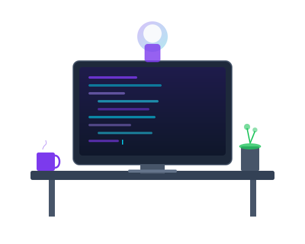
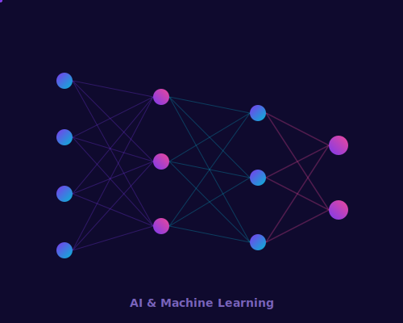
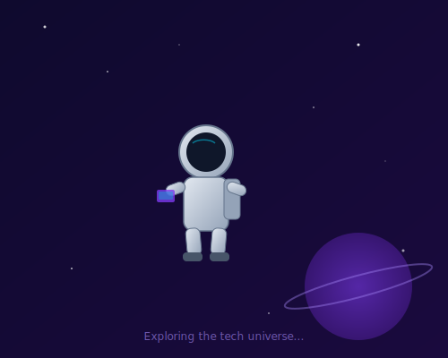

<!-- ============================================================================
     🚀 AUTO-GENERATED README
     ============================================================================
     This file is automatically composed from /components by scripts/update-stats.js.
     Do NOT edit this file directly — edit individual component files instead.
     
     Components: hero.md, about.md, tech-stack.md, stats.md, projects.md,
                 achievements.md, quote.md, contact.md, footer.md
     ============================================================================ -->

<!-- ======================================================================== -->
<!-- 🎯 HERO SECTION                                                          -->
<!-- Animated header banner, typing SVG, and social badges                     -->
<!-- ======================================================================== -->

<!-- Capsule-render animated header banner -->

<!-- Typing SVG animation -->

 

<!-- Social badges row -->

 

<!-- Profile views counter -->

&nbsp;

<!-- Section divider -->

<!-- ======================================================================== -->
<!-- 🧑‍💻 ABOUT ME SECTION                                                     -->
<!-- Personal bio with key highlights                                         -->
<!-- ======================================================================== -->

##  &nbsp; About Me

 

> *"Code is like humor. When you have to explain it, it's bad."* — Cory House

 

- 🔭 &nbsp; Currently working on **awesome open-source projects**
- 🌱 &nbsp; Learning **Rust, WebAssembly, and Cloud Architecture**
- 👯 &nbsp; Looking to collaborate on **innovative full-stack applications**
- 🤔 &nbsp; Exploring **AI/ML integration** in web applications
- 💬 &nbsp; Ask me about **React, Node.js, TypeScript, or System Design**
- ⚡ &nbsp; Fun fact: I debug with `console.log` and I'm not ashamed 😄
- 🎯 &nbsp; **2026 Goals:** Contribute to 50+ open source projects
- 📫 &nbsp; Reach me at: **your.email@example.com**

 

<!-- Section divider -->

<!-- ======================================================================== -->
<!-- 🛠️ TECH STACK SECTION                                                     -->
<!-- Skill badges grouped by category with consistent styling                 -->
<!-- ======================================================================== -->

##  &nbsp; Tech Stack

### 💻 Languages

### 🚀 Frameworks & Libraries

### 🧰 Tools & Platforms

### ☁️ Cloud & Databases

<!-- Section divider -->

<!-- ======================================================================== -->
<!-- 📊 GITHUB STATS SECTION                                                   -->
<!-- Stats cards, streak stats, and top languages                             -->
<!-- ======================================================================== -->

##  &nbsp; GitHub Stats

<!-- GitHub Stats Card -->

&nbsp;
<!-- Top Languages Card -->

  

<!-- Streak Stats -->

  

<!-- Activity Graph -->

 

<!-- Contribution Snake Animation -->

  <picture>
    <source media="(prefers-color-scheme: dark)" srcset="https://raw.githubusercontent.com/Praveenmanoharand/Praveenmanoharand/output/github-contribution-grid-snake-dark.svg"/>
    <source media="(prefers-color-scheme: light)" srcset="https://raw.githubusercontent.com/Praveenmanoharand/Praveenmanoharand/output/github-contribution-grid-snake.svg"/>
    
  </picture>

<!-- Section divider -->

<!-- ======================================================================== -->
<!-- 🏆 FEATURED PROJECTS SECTION                                              -->
<!-- Pinned project cards with descriptions, tech badges, and links           -->
<!-- ======================================================================== -->

##  &nbsp; Featured Projects

<table>
<tr>
<td width="50%">

### 🌐 Project Alpha

A full-stack web application with real-time collaboration features, built with modern technologies and deployed on cloud infrastructure.

</td>
<td width="50%">

### 🤖 ML Pipeline

End-to-end machine learning pipeline with automated training, evaluation, and deployment. Features model versioning and A/B testing.

</td>
</tr>
<tr>
<td width="50%">

### 📱 Mobile App

Cross-platform mobile application with offline-first architecture, push notifications, and biometric authentication.

</td>
<td width="50%">

### ⚙️ CLI Toolkit

Developer productivity CLI toolkit with code scaffolding, project templating, and automated workflow commands.

</td>
</tr>
</table>

 

<!-- Section divider -->

<!-- ======================================================================== -->
<!-- 🏅 ACHIEVEMENTS SECTION                                                   -->
<!-- Certifications, awards, and GitHub trophies                              -->
<!-- ======================================================================== -->

##  &nbsp; Achievements & Trophies

<!-- GitHub Profile Trophy -->

  

### 📜 Certifications & Awards

<table>
<tr>
<td align="center" width="25%">
  
   <b>AWS Solutions Architect</b>
</td>
<td align="center" width="25%">
  
   <b>GCP Cloud Developer</b>
</td>
<td align="center" width="25%">
  
   <b>Meta Frontend Developer</b>
</td>
<td align="center" width="25%">
  
   <b>Hacktoberfest 2025</b>
</td>
</tr>
</table>

<!-- Section divider -->

<!-- ======================================================================== -->
<!-- 💭 QUOTE SECTION                                                          -->
<!-- Rotating developer quote widget                                          -->
<!-- ======================================================================== -->

##  &nbsp; Dev Quote of the Day

<!-- Random dev quote — refreshes on each page load -->

  

<!-- AI illustration accent -->

<!-- Section divider -->

<!-- ======================================================================== -->
<!-- 📬 CONTACT SECTION                                                        -->
<!-- Social links as badge icons                                              -->
<!-- ======================================================================== -->

##  &nbsp; Connect With Me

&nbsp;

&nbsp;

&nbsp;

&nbsp;

&nbsp;

&nbsp;

  

<!-- Astronaut illustration accent -->

<!-- Section divider -->

<!-- ======================================================================== -->
<!-- 👋 FOOTER SECTION                                                         -->
<!-- Footer banner, thank-you note, and visitor counter                       -->
<!-- ======================================================================== -->

 

### 🎉 Thanks for visiting my profile! Let's build something amazing together.

 

<!-- Visitor counter badge -->

 

<!-- Capsule-render animated footer wave -->

<!-- ======================================================================== -->
<!-- 📝 Auto-composed from /components by scripts/update-stats.js              -->
<!-- ⭐ Star this repo if you found it useful!                                 -->
<!-- ======================================================================== -->
